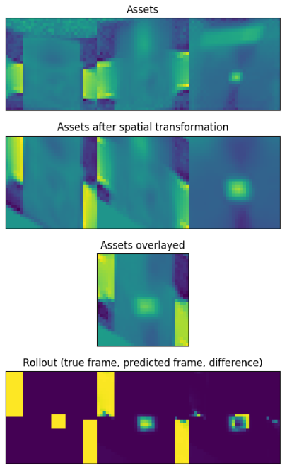
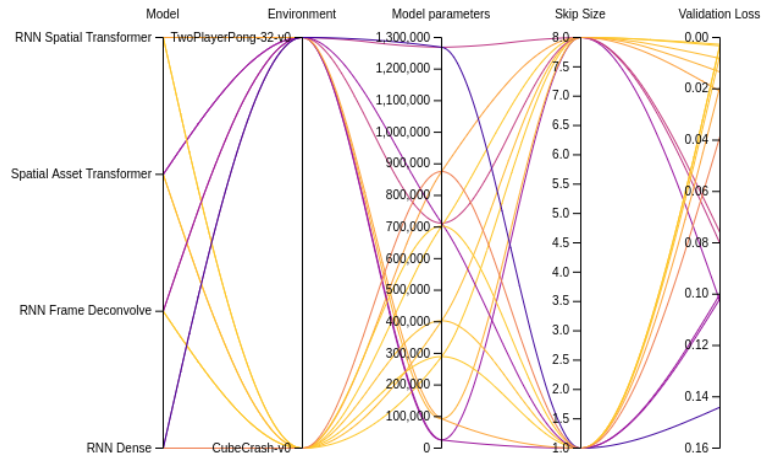
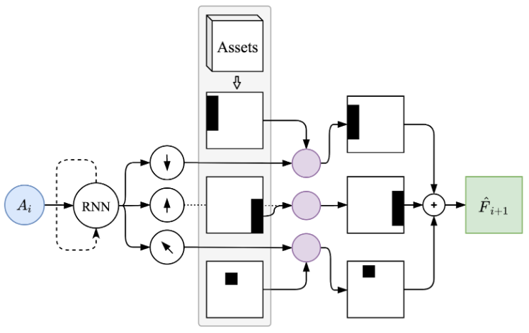
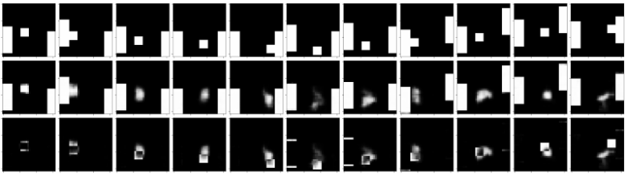
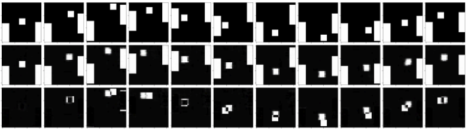
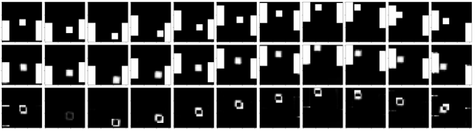

# Forward model

Previous notebooks and experiments can be found [here](https://github.com/ichko/differentiable-simulation).

Experiments and models for my masters thesis on learning environment dynamics from observations.

- [W&B project](https://app.wandb.ai/ichko/forward_models)
- [Google Docs of my masters](https://docs.google.com/document/d/1a7fxuHeIYLJD2ZPL9yHcXiG7PGmSVxTuiN-7uU6i41k)
- [Google Docs of the summary of my masters](https://docs.google.com/document/d/1vaje3BEKWGcNAOkqg1pZA206oVw6ojhbJNod7F8b88k)

## Structure of the project

```txt
src
  data
  loggers           (implementation of the wnb logger)
  models            (implementations of models)
  pipelines
    train           (training module)
    eval            (evaluation module)
    train_eval_all  (script for running train and eval on all the configurations)
    config          (configuration of all the runs)
  scrips            (scrips for visualization)
  utils             (generic utilities and modules)
```

## How to run

You will need Python >= 3.6

1. **Install the requirements:**

```sh
pip install -r requirements.txt
```

2. **Execute:**

```sh
wandb login
```

to log in wandb and be able to view the training results.

3. **Create the following folders in the root directory:**

```txt
.reports
.models
.results
```

4. **Run train and eval for all of the configurations setup in `src/pipelines/config` - all of the models described in the thesis.**

```sh
python -m src.pipeline.train_eval_all
```

Observe the results in the generated wnb project.

## Visualizations

**Visualize live model reconstruction with:**

```sh
python -m src.scripts.play_model
```

set the desired model configuration at the top of the file - as a `get_hparams` parameter.

**Visualize live Asset Spatial RNN model:**

```sh
python -m src.scripts.animate_asset_model
```



**Visualization of seep of 16 train runs**



**Diagram of the Asset Spatial Transforming RNN**



Described in the thesis.

**Example reconstructed episodes**





## Notes and tasks

- [Profiling code](https://toucantoco.com/en/tech-blog/tech/python-performance-optimization)

  - `pip install profiling`
  - `profiling live-profile -m src.pipeline.train -- --debug`

- General stuff

  - [x] Mask out empty (padded) frames after rollout has finished. [See here.](https://www.kdnuggets.com/2018/06/taming-lstms-variable-sized-mini-batches-pytorch.html)
  - [ ] Label smoothing. Do I actually want that?

- Models

  - [x] RNN Deconvolution Baseline
  - [x] Learn frame transformations
    - Instead of compressing the state like the RNN does
    - Action + Precondition (last few frames) -> transformation vector T
    - Use T to transform the current frame to the future frame
    - [x] Play rollout of frame transformations - results in wandb look promising

- Notes

  - 12.06.2020

    - Update implementation of RNN Deconv
    - Focus on making RNN deconv work on PONG
      - WHY RNN Deconv - it is the only model that can model PONG with the current setup of the data pipeline.
      - Frame transforming models need two frames as context
      - TODO:
        [ ] Train and save working RNN Deconv model
        [ ] Write playing script
        [ ] Write script for manipulating the latent RNN state and viewing the result?

  - 06.06.2020

    - Implement pong agent class + action mappings ([3, 3] => 9)
    - Make RNN Playable (interface like a gym)

  - 04.06.2020
    - [BUGFIX] Found major bug in RNN models - the pred frames and true frames were not aligned, the model was trying to predict the present from the present
    - [BUGFIX] TimeDistributed (decorator) module was not holding the wrapped module in it's state resulting in the parameters of the wrapped module not being part of the overall model, resulting in the model not being able to be trined. (Took quite some time)
    - [FEATURE] Implemented `generic multiprocessing` function spawner and `random agent rollout generator` that leads to newer rollouts in the training buffer faster. Hopefully this can reduce over-fitting.
